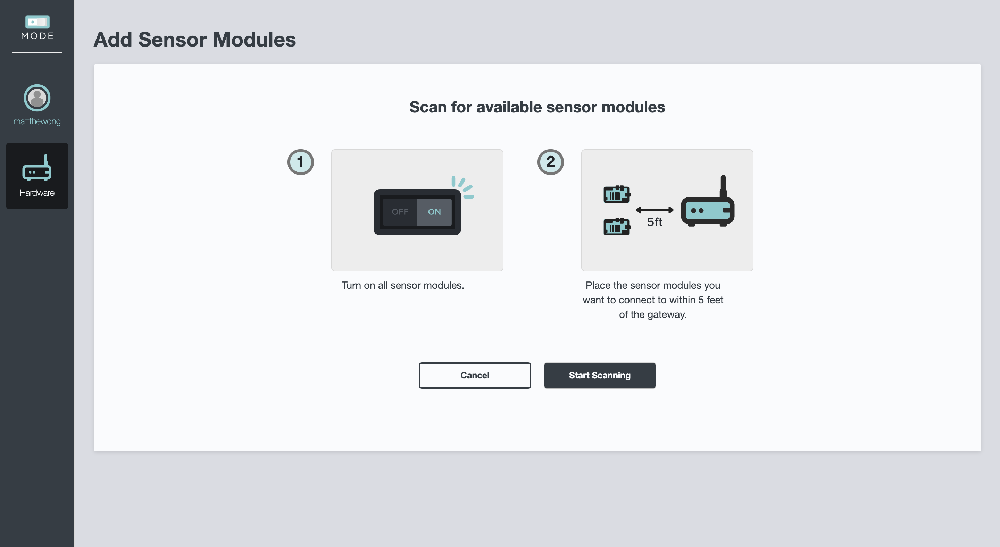
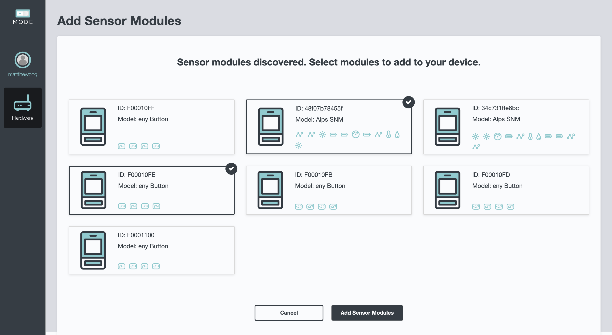
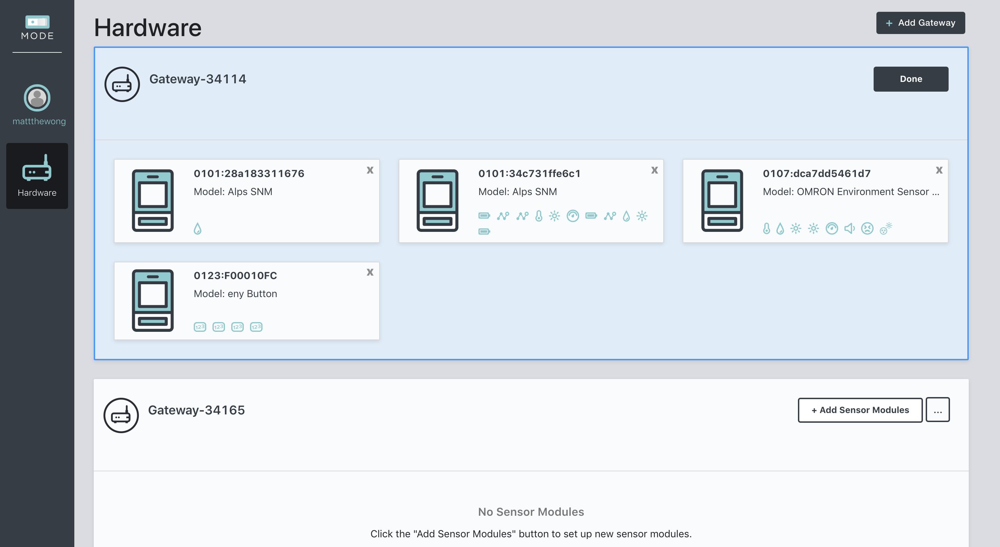
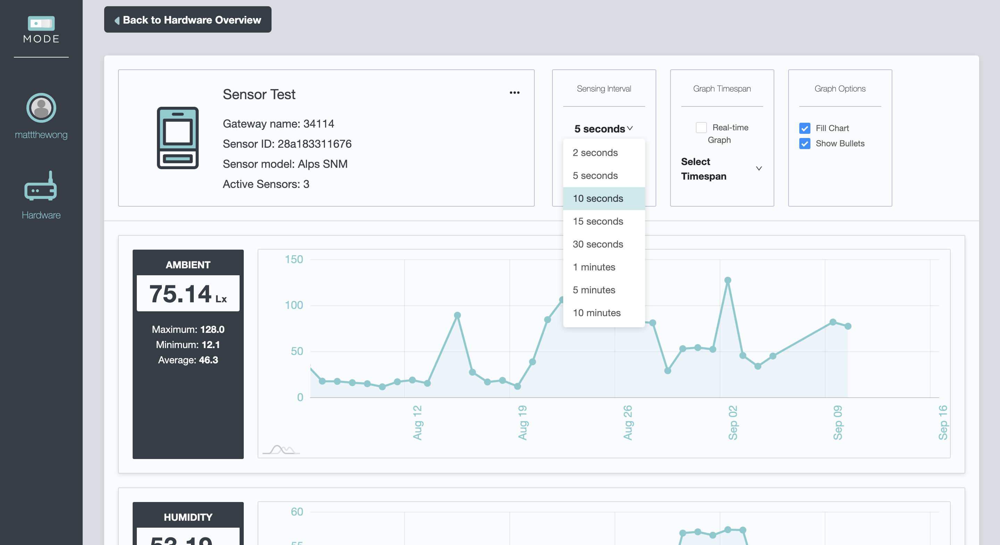

# Sensor-Cloud-Eval

Sensor Cloud Eval is a **TSX version** of MODE's Sensor Cloud, developed to be used as an evaluation kit by business partners and app developers. The codebase outlines the latest SPA development design from React / Typescript, including [context](https://reactjs.org/docs/context.html) and [flux-style data flow](https://facebook.github.io/flux/), [hooks](https://reactjs.org/docs/hooks-intro.html), [websockets](https://developer.mozilla.org/en-US/docs/Web/API/WebSockets_API/Writing_WebSocket_client_applications), and more.

## Contents

- [Features](#features)
- [Installation and Setup](#installation-and-setup)
- [Prerequisites](#prerequisites)
- [Quick start](#quick-start)
- [Setting Up Custom SMS and Email Templates](#setting-up-custom-sms-and-email-templates)
- [Mode API Reference](https://dev.tinkermode.com/docs/api/)
- [App Navigation](#app-navigation)
  - [Adding and Deleting Gateways](#adding-and-deleting-gateways)
  - [Link and Unlink Sensor Modules to and from a Gateway](#link-and-unlink-sensor-modules-to-and-from-a-gateway)
  - [Viewing and Manipulating the Sensor Module](#viewing-and-manipulating-the-sensor-module)
- [API Examples](#api-examples)
  - [Using REST Endpoints (GET, POST, PUT, PATCH, DELETE)](#using-rest-endpoints)
    - [Handling User Information](#handling-user-information)
    - [Linking / Unlinking Sensor Modules](#linking-and-unlinking-sensor-modules)
    - [Sending Device Commands](#sending-device-commands)
  - [Receiving Device Events (Websocket)](#receiving-device-events)
- [Deployment](#deployment)
- [Acknowledgements](#acknowledgements)
- [Links](#links)

## Features

- Management of sensor modules and their device associations from within the application. :electric_plug:

- Ability to view real-time sensor data in multiple sensor modules across multiple devices. :chart_with_upwards_trend:

- Ability to view time-series sensor data and toggle between various time-horizons as well as sensing intervals. :clock10:

- Configuration of sensor module sensing and general settings. :arrows_counterclockwise:

## Installation and Setup

To begin development off MODE's sensor cloud evaluation kit, first obtain the zip file containing the software.

## Prerequisites

1. You must have an account with the [MODE Developer Console](https://console.tinkermode.com/console/signup).

2. You will need to pre-provision the gateway(s) for your project and create an App before running the application. Follow the instruction from the [MODE Developer Central](https://dev.tinkermode.com/getting-started/step-one).

3. You will also need to have any sensors you wish to pair with your gateway(s) in your possession.

4. If you don't already have node installed, you will need to install Node. The application works with `Node 8.16.0` or `Node 10.16.0` or later version on your local development machine. If you don't already have node, please navigate [here](https://nodejs.org/en/download/) to download the source code compatible with your machine. `NPM is distributed with Node.js`, which means that when you downlaod Node.js, you automatically get npm installed on your computer.

## Quick Start

**Assuming you have met the previously mentioned prerequisites**, follow these steps to get up and running in minutes:

1. Create a `.env` file inside of the `/sceval_frontend` directory with the `REACT_APP_PROJECT_ID` and `REACT_APP_ID` variables associated with your project. Please see the example below:

```sh
REACT_APP_PROJECT_ID={YOUR_PROJECT_ID}
REACT_APP_APP_ID={YOUR_APP_ID}
```

2. `cd` into `sceval_frontend` and run `npm i` or `npm install`. This will install the default app dependencies.

3. Run `npm start` to immediately bring up the application at http://localhost:3000.

4. Navigate to http://localhost:3000 your browser to view the running application.

## Setting Up Custom SMS and Email Templates

The handling of user accounts and authentication involves communication with your users either via SMS texts or emails. MODE allows you to customize the content of these messages so that you can provide your users with the best possible experience. For more information setting up this kind of customization, please take a look at our documentation [here](https://dev.tinkermode.com/doc/platform/user-accounts).

## App Navigation

### Adding and Deleting Gateways

SCEVAL provides a way for a developer to add gateways to his/her project. In order to provision a device on demand, the developer must first put the device in `Claim Mode`. Running the provided shell script will put the device in claim mode, allowing the developer to add a gateway directly from the app.

To properly configure the shell script, you will need to obtain the device ID and associated API key, assigning them to the correct variables. Once add, you can run:

```sh
$ sh provision.sh
```

Once you run the script, you will be able to add the claim code within the app. To do so, navigate to the Hardware page, click `Add Gateway` and enter the claim code found on your device. Once successfully added, the developer will see that a new gateway was added to their project.


Deleting a gateway disassociates that gateway from the user's home. To delete a gateway and its sensor module associations, select `Delete Device` from the device settings dropdown. A popup will prompt the user to confirm whether this action is desired, and if the user selected `OK`, will remove the gateway and its associations from the project.


### Link and Unlink Sensor Modules to and from a Gateway

Linking and unlinking sensor modules to and from a gateway is simple. Assuming you have the sensor module(s) on hand, make sure they are within 5 feet of the gateway, and press the start scanning button.



Once you press the start scanning button, the device will go into `discovery mode` and begin looking for sensors either available to connect via Bluetooth or USB.


If the gateway discovers any sensor modules `currently not paired` to itself or any other gateways, they will be listed in the format below. Selecting any available module will allow you to add the sensor module to your desired gateway.



In the gateway view, you will be able to see all sensor module(s) associated with your gateway(s). To unlink a particular sensor module from the gateway, click the settings icon and then press the `Unlink Sensor Modules` button that appears.


After selecting the `Unlink Sensor Modules` button, the gateway will go into edit mode. It's worth mentioning you can put multiple gateways in edit mode.



Selecting a particular sensor module in this mode will trigger a unlink confirmation of the selected module, and clicking okay will disassociate it from the gateway.


Clicking on a sensor module in a gateway that is not in `edit mode` will show sensor module details. This page contains real-time data, time-series graphs, adjustments, and the general settings of the sensor module.



Clicking the settings icon and then clicking the `Edit Settings` button will display the sensor module settings, including the name of the module and the currently active sensors. To modify this, edit the name and select or deselect sensors to activate or inactive the sensors respectively.


The active sensor time-series graphs and real-time data will be updated accordingly.

## Viewing and Manipulating the Sensor Module

## API Examples

We've listed most of the useful [endpoints](https://dev.tinkermode.com/docs/api/) useful for building applications with sensor cloud below.

```javascript
const BASEURL = 'https://api.tinkermode.com/'
```

**Endpoint**                                                             | **TYPE**                  |
-------------------------------------------------------------------------|--------------------------:|
/auth/user                                                               | POST                      |
/auth/user/passwordReset/start                                           | POST                      |
/users/{id}                                                              | GET, POST, PATCH, DELETE  |
/homes/{homeId}/members                                                  | GET, POST                 |
/homes/{homeId}/members/{userId}                                         | GET, PATCH, DELETE        |
/homes/{homeId}                                                          | GET, POST, PATCH, DELETE  |
/homes/{homeId}/kv/{sensorModuleId}                                      | GET, POST, PUT            |  
/homes/{homeId}/smartModules/tsdb/timeSeries/{seriesID}                  | GET                       |
/devices/{deviceId}                                                      | GET, PATCH, DELETE        |
/devices/{homeId}                                                        | GET                       |  
/devices/{deviceId}/command                                              | PUT                       |
/devices/{homeId}                                                        | GET                       |
/devices/{deviceId}/kv/{sensorModuleId}                                  | GET, POST, PUT            |

### Using REST Endpoints

Below are some examples pertaining to the usage of **REST endpoints**.

#### Handling User Information

`/users`  
To create [user](https://dev.tinkermode.com/docs/api/models.html#user) a user with an email and password, create a POST request with the following parameters:

```javascript
projectId: {project id},
email: {email},
password: {password},
name: {name}
```

`/auth/users`  
To verify a user's credentials, create a POST request with the following parameters to check whether or not the user exists.

```javascript
projectId: {project id},
appId: {app id},
email: {email},
password: {password}
```

`/users/{userId}`  
To update a user's name and/or password, create a PATCH request with the following parameters.

```javascript
name: {newName},
password: {newPassword}
```

#### Linking and Unlinking Sensor Modules

`/devices/{deviceId}/kv/{sensorModuleId}`  
MODE stores key-value pairs in a given home to manage kinds of data, including sensor data. One can associate or disassociate sensor modules to/from a particular gateway by using a PUT or DELETE request and the following payload parameters. It's worth mentioning that the `arrayOfSensorsActive` can be used to enable/disable sensing of particular sensors within a given sensor module.

```javascript
id: {sensorModuleId},
sensing: 'on',
interval: '30',
sensors: {arrayOfSensorsActive}
```

#### Sending Device Commands

`/devices/{deviceID}/command`  
Sending commands to gateways within a project can allow the user to control the behavior of the targeted gateway. Common commands include `startDiscovery`, which puts the gateway into discovery mode for finding nearby sensor modules. Another example of this is the `listSensorModules`, which lists the sensor modules associated to that particular gateway. A action and (occassionally) a timeout parameter must be provided for this command to work. The timeout specifies how long the action will last for.

- Using the `startDiscovery` command

```javascript
action: 'startDiscovery',
parameters: { timeout: 1000 }
```

- Using the `listSensorModules` command

```javascript
action: 'listSensorModules',
parameters: { timeout: 1000 }
```

- Using the `getSensorModuleStatus` command

```javascript
action: 'getSensorModuleStatus',
parameters: { sensorId: {sensorId} }
```

- Using the `syncClock` command

```javascript
action: 'syncClock',
parameters: { sensorId: {sensorId} }
```

- Using the `getLog` command

```javascript
action: 'getLog',
parameters: { sensorId: {sensorId} }
```

### Receiving Device Events

The application receives device events in the form of a websocket message. The following information provides insight into the kinds of websocket events that can be received and used by the application.

1. `discoveredSensorModules`: Emitted after recieving the `startDiscovery` command. Contains a list of sensor modules detected by the gateway.

2. `sensorModuleList`: The gateway emits this event periodically to report its current state, or after it receives a `listSensorModules` command. This event contains information like linked sensor modules, services, homeId, and other device-related information.

3. `realtimeData`: The gateway emits this event periodically to report the current value of each active sensor on its sensor modules. The event data is formatted in the schema required by the Time Series Database.

4. `sensorModuleStatus`: The gateway emits this event after receiving the `getSensorModuleStatus` command. The event data contains information about the sensor module’s battery level and signal strength.

5. `sensorModuleClockSynced`: The gateway emits this event after it successfully executed the `syncClock` command on a sensor module. The event data includes a field called `sensorModuleId` which contains the UUID of the affected sensor module.

6. `error`: The gateway emits this event when it has problem executing a command. The event contains a field called `msg` that explains the reason of the error.

7. `sensorModuleStateChange`: The gateway emits this event whenever a sensor module changes its connection state and/or sensing state.

## Deployment

SCEVAL provides a built-in Dockerfile for generating Docker images to run as containerized applications in the cloud. SCEVAL was built using a NginX app server and hosted in Amazon's Fargate service, but can also be deployed and hosted on other platforms as outlined in [React's Deployment Documentation](https://create-react-app.dev/docs/deployment). If you are curious about how to deploy containerized applications to cloud platforms like AWS, GCP, and others, feel free to contact us directly.

To create a local Docker image of your customized SCEVAL application, go to the root of the directory and run:

```sh
$ docker build . -t {your app name}
```

This will build your docker image locally, using React's `npm run-script build` method for production. This image can then be pushed to a containerized service like Dockerhub or Amazon Fargate.

## Acknowledgements

We are grateful to the authors of SCEVAL and its implementation of the MODE Platform API.

- [@mattthewong](https://github.com/mattthewong)

- [@bill-mode](https://github.com/bill-mode)

- [@reprimande](https://github.com/reprimande)

## Links

* [Corp Site](https://www.tinkermode.com/)
* [Developer Site](https://dev.tinkermode.com/)
* [Developer Docs](https://dev.tinkermode.com/docs/)
* [Tinkermode Console](https://console.tinkermode.com/console/login)
* [SCEVAL Source Code](https://github.com/moderepo/sensor-cloud-eval)